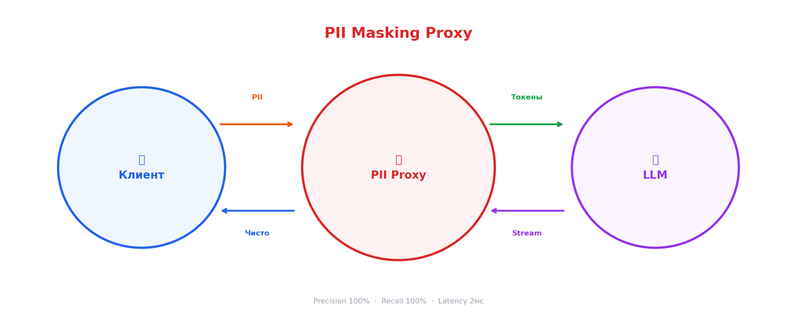

# Обновлённый README.md

# PII Masking Proxy

> Real-time прокси для защиты персональных данных при обращении к LLM.  
> Маскирует PII в запросах, размаскирует в потоковых ответах (SSE streaming).  
> В pipeline детекции **LLM не используется** — только regex + NER.


## Архитектура




---

## Возможности

| Фича | Детали |
|---|---|
| **10 типов PII** | ФИО, телефон, email, паспорт, СНИЛС, ИНН, карта, счёт, дата, адрес |
 | **Валидация** | Контрольные суммы ИНН, СНИЛС, алгоритм Луна для карт |
| **Streaming** | Размаскирование в реальном времени через SSE (конечный автомат) |
 | **Табличные данные** | Маскирование CSV с автодетекцией PII-колонок |
 | **Multi-turn** | Сессии с уникальными токенами для каждого человека |
 | **Output scanning** | Обнаружение утечек новых PII в ответах LLM |
 | **Audit trail** | Логирование всех операций для compliance (ФЗ-152) |
| **Thread-safe** | Конкурентная обработка запросов |
 | **Docker** | Запуск одной командой |

---

##  Быстрый старт

### Локально

```bash
# 1. Клонировать
git clone <repo>
cd AlphaProject

# 2. Установить зависимости
pip install -r requirements.txt

# 3. Настроить (опционально — без .env работает с Mock LLM)
cp .env.example .env
# Вставить LLM_API_KEY для Mistral

# 4. Запустить
uvicorn api.main:app --reload

# 5. Открыть
#    Демо:     http://localhost:8000/static/index.html
#    Swagger:  http://localhost:8000/docs
```

### Docker

```bash
docker-compose up --build
# Открыть http://localhost:8000/static/index.html
```

---

##  Тесты и метрики

```bash
# Тесты (219+)
pytest tests/ -v

# Оценка качества
python utils/evaluate.py

# Бенчмарки производительности
python utils/benchmark.py

# Демо-вывод для презентации
python utils/demo_output.py
```

### Результаты

| Метрика | Значение |
|:--------|:--------:|
| **Precision** | 100% |
| **Recall** | 100% |
| **F1 Score** | 100% |
| **Avg Latency (masking)** | 2.1 мс |
| **Regex Detector** | 0.08 мс |
| **NER (Natasha)** | 3.9 мс |
| **StreamInterceptor** | 0.02 мс |
| **Полный pipeline** | 3.6 мс |
| **Тестов** | 219+ |

---

## API Endpoints

| Метод | Путь | Описание |
|:------|:-----|:---------|
| `POST` | `/api/chat` | Маскирование → LLM → размаскирование (SSE / sync) |
| `POST` | `/api/analyze` | Анализ текста: подсветка PII, детали обнаружения |
| `POST` | `/api/table` | Маскирование CSV файла |
| `GET` | `/api/health` | Health check |
| `GET` | `/api/audit/stats` | Статистика аудита |
| `GET` | `/api/sessions` | Активные сессии |
| `GET` | `/api/history/{id}` | История чата сессии |

### Пример запроса

```bash
curl -X POST http://localhost:8000/api/chat \
  -H "Content-Type: application/json" \
  -d '{"message": "Я Иванов Пётр, тел +7 999 123-45-67. Баланс?", "stream": false}'
```

### Пример ответа

```json
{
  "original_message": "Я Иванов Пётр, тел +7 999 123-45-67. Баланс?",
  "masked_message": "Я [PERSON_1], тел [PHONE_1]. Баланс?",
  "llm_response_clean": "Здравствуйте, Иванов Пётр! Баланс: 45 230,50 руб.",
  "mapping": {
    "[PERSON_1]": "Иванов Пётр",
    "[PHONE_1]": "+7 999 123-45-67"
  },
  "entities_found": 2,
  "stats": {
    "total_found": 2,
    "by_type": {"PERSON": 1, "PHONE": 1},
    "latency_ms": 3.2
  }
}
```

---

## Типы обнаруживаемых PII

| Тип | Метод | Валидация | Пример |
|:----|:------|:----------|:-------|
| ФИО | NER + Regex (контекст) | — | Иванов Пётр Сергеевич |
| Телефон | Regex | Формат +7/8 | +7 999 123-45-67 |
| Email | Regex | Формат @ | ivan@mail.ru |
| Паспорт РФ | Regex | Серия (регион 01-99) | 45 15 123456 |
| СНИЛС | Regex | Контрольная сумма | 112-233-445 95 |
| ИНН (10/12 цифр) | Regex | Контрольные разряды | 7707083893 |
| Банковская карта | Regex | Алгоритм Луна | 4532 0151 1283 0366 |
| Расчётный счёт | Regex | Префикс (408, 423...) | 40817810099910004312 |
| Дата рождения | Regex | Формат DD.MM.YYYY | 15.03.1990 |
| Адрес | NER (Natasha) | — | г. Москва, ул. Ленина, д. 5 |

---

## Стек технологий

| Компонент | Технология | Зачем |
|:----------|:-----------|:------|
| API | FastAPI + SSE | Async, streaming, auto-docs |
| NER | Natasha | Лучший NER для русского языка |
| Детекция | Regex + checksum | Быстро, точно, без ML |
| Стриминг | Конечный автомат | Размаскирование по 1 символу |
| LLM | Mistral API (OpenAI-совместимый) | Или любой другой |
| Тесты | pytest (219+) | Unit, integration, adversarial |
| Контейнер | Docker + docker-compose | Запуск одной кнопкой |

---

## Структура проекта

```
AlphaProject/
├── api/                          # FastAPI приложение
│   ├── main.py                   # Точка входа
│   ├── routes.py                 # Все эндпоинты
│   └── schemas.py                # Pydantic модели
├── detectors/                    # Детекция PII
│   ├── regex_detector.py         # 10 типов regex-паттернов
│   ├── ner_detector.py           # Natasha NER (ФИО, адреса)
│   ├── checksum_validator.py     # ИНН, СНИЛС, Луна
│   └── detector_pipeline.py      # Объединение детекторов
├── services/                     # Бизнес-логика
│   ├── masking_service.py        # Маскирование текста
│   ├── unmasking_stream.py       # StreamInterceptor (конечный автомат)
│   ├── session_store.py          # Сессии + история + счётчики
│   ├── chat_history.py           # Multi-turn диалоги
│   ├── tabular_masker.py         # Маскирование CSV
│   ├── output_scanner.py         # Сканирование ответа LLM
│   ├── llm_client.py             # Клиент Mistral API
│   └── audit_logger.py           # Аудит-лог (compliance)
├── mocks/
│   └── llm_simulator.py          # Mock LLM (12 сценариев)
├── tests/                        # 219+ тестов
│   ├── test_api.py
│   ├── test_analyze.py
│   ├── test_audit_*.py           # Аудит-тесты (edge cases)
│   ├── test_chat_history.py
│   ├── test_checksum.py
│   ├── test_masking_service.py
│   ├── test_output_scanner.py
│   ├── test_regex_detector.py
│   ├── test_tabular_masker.py
│   └── ...
├── utils/
│   ├── evaluate.py               # Precision / Recall
│   ├── benchmark.py              # Латенция компонентов
│   ├── generate_data.py          # Генератор синтетических данных
│   └── demo_output.py            # Вывод для презентации
├── static/
│   └── index.html                # Веб-демка (чат + анализ + таблица + дашборд)
├── config.py                     # Конфигурация через ENV
├── .env.example                  # Пример переменных окружения
├── requirements.txt
├── Dockerfile
├── docker-compose.yml
└── README.md
```

---

## Соответствие ФЗ-152

| Требование | Реализация |
|:-----------|:-----------|
| PII не покидают периметр | Маскирование **до** отправки в LLM |
| Аудит операций | AuditLogger — кто, когда, какие PII обработаны |
| Минимизация данных | Только необходимые PII заменяются |
| Контроль утечек | OutputScanner проверяет ответы LLM |
| Сессионная изоляция | Каждая сессия имеет свой маппинг |

---

## Конфигурация

Через `.env` файл или переменные окружения:

```env
# LLM
LLM_API_KEY=your-mistral-key     # Ключ API
LLM_API_URL=https://api.mistral.ai/v1/chat/completions
LLM_MODEL=mistral-small-latest
USE_MOCK_LLM=true                 # true — без реального LLM

# Детекция
USE_NER=true                      # Natasha NER для ФИО/адресов
```

---

## Команда

Разработано на хакатоне Альфа-Банка, 2026.
```
